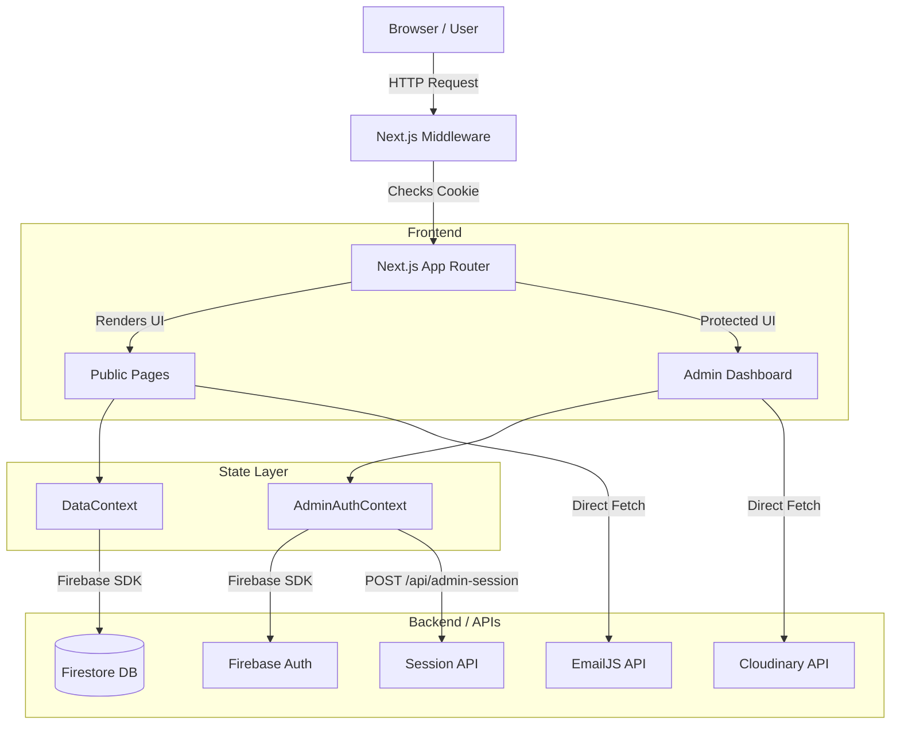

# K.G. Portfolio & CMS Platform
**Single Source of Truth Documentation**

## Table of Contents
1. [Project Overview](#section-1-project-overview)
2. [Technology Stack](#section-2-technology-stack-detailed)
3. [Project Architecture](#section-3-project-architecture)
4. [Pages & Routes Documentation](#section-4-pages--routes-documentation)
5. [Component Library / UI System](#section-5-component-library--ui-system)
6. [State Management](#section-6-state-management)
7. [API & Backend Documentation](#section-7-api--backend-documentation)
8. [Database & Data Layer](#section-8-database--data-layer)
9. [Algorithms, Patterns & Concepts](#section-9-algorithms-patterns--concepts)
10. [Third-Party Integrations](#section-10-third-party-integrations)
11. [Environment Variables Reference](#section-11-environment-variables-reference)
12. [Testing Strategy](#section-12-testing-strategy)
13. [Build, Deployment & DevOps](#section-13-build-deployment--devops)
14. [Performance Analysis](#section-14-performance-analysis)
15. [Security Audit](#section-15-security-audit)
16. [UI/UX Analysis](#section-16-uiux-analysis)
17. [Code Quality Assessment](#section-17-code-quality-assessment)
18. [Improvement Roadmap](#section-18-improvement-roadmap)
19. [Developer Onboarding Guide](#section-19-developer-onboarding-guide)
20. [Open Questions & Unknowns](#section-20-open-questions--unknowns)

---

## SECTION 1: PROJECT OVERVIEW

**Name:** Karrtik Gupta Portfolio & Admin CMS
**Purpose:** A high-performance, fully dynamic personal portfolio website bundled with a bespoke Content Management System (CMS). The application serves as a digital resume, blog, and showcase while allowing the owner to modify all content (projects, blogs, timeline, about, socials) directly from a secure, hidden admin dashboard without touching the source code.

**Problem Solved:** Replaces static portfolios that require code commits for content updates with a dynamic, database-driven system, empowering the user with an intuitive editorial CMS to manage their digital identity.

**Intended Audience:** Recruiters, clients, and fellow developers (public site), and the portfolio owner (admin dashboard).

**Current Status:** Production (MVP completed, actively maintained).

**Tech Stack Summary:**
- **Frontend:** Next.js 16 (App Router), React 19, Tailwind CSS v4, Framer Motion
- **Backend/DB:** Firebase Firestore, Next.js Edge Middleware
- **Auth:** Firebase Auth, httpOnly cookies
- **Storage:** Cloudinary (Images)

---

## SECTION 2: TECHNOLOGY STACK (DETAILED)

| Layer | Technology | Version | Purpose / Why It's Used |
|---|---|---|---|
| **Framework** | Next.js | 16.2.9 | Core framework using App Router for React Server Components, routing, and SSR/SSG. |
| **UI Library** | React | 19.2.4 | UI component building. |
| **Styling** | Tailwind CSS | v4 | Utility-first CSS framework for rapid, consistent styling. |
| **Animations** | Framer Motion | 12.42.0 | Used for fluid page transitions, layout animations, and micro-interactions. |
| **State Mgt.** | React Context | Native | Used via `DataContext` and `AdminAuthContext` for global data and auth state. |
| **Database** | Firebase Firestore | 12.15.0 | NoSQL cloud database storing all dynamic site content. |
| **Auth** | Firebase Auth | 12.15.0 | Handles admin login via email/password. |
| **Rich Text** | Tiptap | 3.30.2 | Headless rich text editor used in the CMS for Medium-style blog authoring. |
| **Storage** | Cloudinary | API | Direct frontend uploads for blog/project images (avoids Firebase storage config). |
| **Forms** | Yup | 1.7.1 | Schema validation for CMS forms and public contact forms. |
| **Email** | EmailJS | 3.2.0 | Sends direct emails from the public contact form without a backend server. |
| **Icons** | Lucide React | 1.22.0 | Consistent vector iconography for the CMS and UI. |
| **Analytics** | Microsoft Clarity | 2.0.0 | Session recording and heatmaps. |

---

## SECTION 3: PROJECT ARCHITECTURE

### 3.1 High-Level Architecture Diagram



### 3.2 Directory Structure

```text
/
├── app/                      # Next.js App Router root
│   ├── api/                  # Next.js API routes (e.g., admin-session)
│   ├── about/                # Public Identity/About page
│   ├── admin/                # CMS routes (dashboard, login)
│   ├── blog/                 # Public journal/blog routes
│   ├── certifications/       # Public badges/certifications page
│   ├── contact/              # Public contact page
│   ├── projects/             # Public systems/projects page
│   ├── services/             # Public services page
│   ├── globals.css           # Global Tailwind and custom CSS vars
│   └── layout.tsx            # Root layout, theme providers, global fonts
├── components/               # React UI Components
│   ├── Admin/                # CMS-specific components (BlogManager, etc.)
│   ├── ui/                   # Reusable base UI (Button, Card, Section)
│   └── (Header, Footer, etc) # Shared layout components
├── context/                  # React Context Providers
│   ├── AdminAuthContext.tsx  # Global admin auth and session state
│   └── DataContext.tsx       # Global CMS data fetching and caching
├── lib/                      # Core logic and utilities
│   ├── firebase.ts           # Firebase app initialization
│   ├── site-config.ts        # Static site metadata
│   ├── hooks/                # Custom React hooks (useData, useDefaults)
│   └── utils/                # Data managers, security, validation, Cloudinary
├── public/                   # Static assets (fonts, manifest)
├── middleware.ts             # Edge network request middleware (protects /admin)
└── next.config.ts            # Next.js build and CSP configuration
```

### 3.3 Architecture Pattern
**Feature-Sliced Monolith (Client-Heavy):** 
The application relies heavily on Client Components (`"use client"`) due to the usage of React Context for global state (`DataContext`) and Framer Motion for animations. While it utilizes the Next.js App Router, most data fetching is done client-side via the Firebase SDK rather than React Server Components (RSCs). 

**Inconsistencies:** The use of `DataContext` to fetch and store *all* site data on initial load is an anti-pattern for large apps (over-fetching), though acceptable for a small portfolio. It negates the SEO benefits of Next.js Server Components since data is hydrated client-side.

### 3.4 Data Flow (Example: Fetching Projects)
1. User loads `/projects`.
2. `page.tsx` calls `useData()` from `DataContext.tsx`.
3. `DataContext` on mount calls `fetchAllData()` which triggers `getProjects()` in `lib/utils/dataManager.js`.
4. `getProjects()` queries the `projects` collection in Firestore.
5. Data is returned, cached in `localStorage` (for fallback), saved to React state, and rendered by the UI.

---

## SECTION 4: PAGES & ROUTES DOCUMENTATION

| Route/Path | Page Component File | Auth Required | Description |
|-----------|-------------------|---------------|-------------|
| `/` | `app/page.tsx` | No | Landing page showcasing hero, featured projects, recent blogs. |
| `/about` | `app/about/page.tsx` | No | Bio, timeline, tech stack, and skills. |
| `/projects` | `app/projects/page.tsx` | No | Grid of all projects fetched from Firestore. |
| `/blog` | `app/blog/page.tsx` | No | List of journal entries. |
| `/blog/[id]` | `app/blog/[id]/page.tsx` | No | Dynamic route for individual blog reading. |
| `/certifications` | `app/certifications/page.tsx` | No | Displays static certifications. |
| `/contact` | `app/contact/page.tsx` | No | Contact form powered by EmailJS. |
| `/admin/login` | `app/admin/login/page.tsx` | No | CMS login portal. |
| `/admin/dashboard`| `app/admin/dashboard/page.tsx`| Yes | The core CMS interface. |

### /admin/dashboard
- **Page Name:** AdminDashboard
- **File Path:** `app/admin/dashboard/page.tsx`
- **Purpose:** Central command center for managing all portfolio content.
- **Components Used:** `ProjectsManager`, `ContentManager`, `BlogManager`, `TimelineManager`, `TechStackManager`, `SocialsManager`.
- **State Management:** Local state for active tabs (`activeTab`), `AdminAuthContext` for auth checks.
- **User Interactions:** Sidebar navigation switches between management modules. Export/Import functionality to backup/restore Firebase data to local JSON files.
- **Guards/Middleware:** Protected by `middleware.ts` (checks `adminSession` cookie) AND a client-side `useEffect` checking `isAuthenticated` from `AdminAuthContext`.

---

## SECTION 5: COMPONENT LIBRARY / UI SYSTEM

### 5.1 Reusable Components
- **`components/ui/Button.tsx`**: Standardized button with variants (primary, secondary, outline, ghost) and sizes. Used heavily in CMS.
- **`components/ui/Card.tsx`**: Standard content container with subtle borders and hover effects. Used for Projects and Blogs.
- **`components/ui/Section.tsx`**: Page wrapper ensuring consistent padding and max-widths.

### 5.2 Design System Analysis
- **Aesthetic:** "Fieldnotes" — Paper/Ink theme, editorial, distraction-free.
- **Typography Scale:** `font-display` (Fraunces), `font-sans` (General Sans), `font-mono` (JetBrains Mono).
- **Color Palette (CSS Vars in globals.css):** 
  - `--background` (Ink/Paper)
  - `--surface` / `--bg-raised`
  - `--text` / `--text-muted`
  - `--border`
  - `--accent` (Terracotta)
- **Consistency:** High. Legacy colors (cyan, blue, amber) were recently scrubbed in favor of strict CSS variable usage.

### 5.3 Third-Party Libraries
- **Framer Motion:** Used for `AnimatePresence` page transitions and modal slide-ins.
- **Tiptap:** Powers `RichBlogEditor.tsx` providing a Medium-like distraction-free canvas with floating bubble menus.
- **React Markdown:** Renders the Tiptap markdown output in `BlogDetailClient.tsx`.

---

## SECTION 6: STATE MANAGEMENT

**Approach:** React Context + Local Component State.
- **`DataContext` (`context/DataContext.tsx`):**
  - **State:** Holds entire Firebase database `{ projects, timeline, techStack, contact, socials, services }`.
  - **Mutations:** None globally. Mutations happen in admin components, which then trigger local refetches.
  - **Anti-pattern:** Fetches ALL data on initial app load, even if the user only visits the homepage. This increases Firebase read costs and initial load time.
- **`AdminAuthContext` (`context/AdminAuthContext.tsx`):**
  - **State:** `isAuthenticated`, `firebaseUser`, `loginAttempts`, `lockoutUntil`.
  - **Actions:** `login()`, `logout()`.

**Server State:** Handled manually via `fetchFromFirebase` utility wrappers in `lib/utils/dataManager.js`. No caching libraries like React Query or SWR are used. Data is backed up to `localStorage` as a poor-man's offline cache.

---

## SECTION 7: API & BACKEND DOCUMENTATION

### 7.1 API Architecture
The app primarily relies on the **Firebase Web SDK** for direct client-to-database communication. Only one Next.js Route Handler exists.

### 7.2 API Endpoint Reference
| Method | Path | Auth | Request Body | Response | Description |
|---|---|---|---|---|---|
| POST | `/api/admin-session` | None | `{ action: 'set' \| 'clear' }` | `{ ok: boolean }` | Sets an `httpOnly` cookie called `adminSession` upon successful Firebase Auth login, enabling Next.js Middleware to protect `/admin/dashboard`. |

### 7.3 Middleware Stack
1. **`middleware.ts`**: Intercepts all requests to `/admin/dashboard/*`. Checks for the `adminSession` cookie. If absent, redirects to `/admin/login?from=/admin/dashboard`.

### 7.4 Authentication & Authorization
- **Strategy:** Firebase Email/Password Auth.
- **Tokens:** Firebase manages JWTs in IndexedDB. `AdminAuthContext` listens to `onAuthStateChanged`.
- **Security Enhancements:** An `adminSession` cookie prevents pre-hydration flashing of protected routes. A client-side brute-force lockout locks the UI after 5 failed attempts for 15 minutes.

### 7.5 Validation Strategy
- **Library:** `yup`.
- **Location:** Defined in `lib/utils/validation.js`. Validated strictly on the client before pushing to Firebase.

---

## SECTION 8: DATABASE & DATA LAYER

### 8.1 Database
**Type:** Firebase Firestore (NoSQL).

### 8.2 Schema Documentation
Collections mapped in `lib/utils/dataManager.js`:
- **`about`** (Doc: `content`): `{ title, subtitle, description, skills }`
- **`contact`** (Doc: `content`): `{ email, phone, location, availability }`
- **`contact`** (Doc: `socials`): `{ items: [{ name, url, icon }] }`
- **`services`** (Doc: `list`): `{ items: [...] }`
- **`projects`** (Docs: Auto-ID): `{ title, description, link, image, category, tech[], featured, year }`
- **`blogs`** (Docs: Auto-ID): `{ title, excerpt, content (Markdown), category, tags[], readTime, date }`
- **`timeline`** (Doc: `data`): `{ items: [...] }`
- **`techStack`** (Doc: `data`): `{ items: [...] }`

*Note on Arrays:* Firestore does not allow root-level arrays. The app wraps arrays in an `{ items: [] }` object, managed by the `unwrapItems` utility.

---

## SECTION 9: ALGORITHMS, PATTERNS & CONCEPTS

- **Brute-Force Lockout (Client-Side):** 
  - **File:** `AdminAuthContext.tsx`
  - **How it works:** Tracks failed logins in React state synced to `sessionStorage`. After 5 fails, sets a timestamp 15 mins in the future. The `login()` function rejects attempts if `Date.now() < lockoutUntil`.
- **Tiptap Drag & Drop Cloudinary Upload:**
  - **File:** `RichBlogEditor.tsx`
  - **How it works:** Intercepts `handleDrop` and `handlePaste` events. Inserts a temporary image placeholder node, asynchronously uploads the `File` to Cloudinary via `FormData` and `fetch`, and replaces the placeholder node with the `secure_url`.
- **Data Export/Import:**
  - **File:** `dataManager.js` & `dashboard/page.tsx`
  - **How it works:** Aggregates all collections into a giant JSON object. Triggers a browser Blob download. Import parses the JSON and runs sequential `setDoc` commands to restore the database state.

---

## SECTION 10: THIRD-PARTY INTEGRATIONS

- **Cloudinary:** 
  - **Purpose:** Image hosting for CMS assets.
  - **File:** `lib/utils/cloudinary.ts`.
  - **Auth:** Unsigned uploads via `upload_preset` (`az9zcctj`) to Cloud Name `f8njovya`.
- **EmailJS:**
  - **Purpose:** Routing contact form submissions to email.
  - **Auth:** Public API Key (`NEXT_PUBLIC_EMAILJS_PUBLIC_KEY`).
- **Microsoft Clarity:**
  - **Purpose:** Analytics and session heatmaps.
  - **File:** `app/layout.tsx`.

---

## SECTION 11: ENVIRONMENT VARIABLES REFERENCE

| Variable Name | Required | Used In | Description | Example |
|---|---|---|---|---|
| `NEXT_PUBLIC_FIREBASE_API_KEY` | Yes | `firebase.ts` | Firebase connection | `AIzaSy...` |
| `NEXT_PUBLIC_FIREBASE_AUTH_DOMAIN` | Yes | `firebase.ts` | Firebase connection | `app.firebaseapp.com` |
| `NEXT_PUBLIC_FIREBASE_PROJECT_ID` | Yes | `firebase.ts` | Firebase connection | `app-id` |
| `NEXT_PUBLIC_EMAILJS_SERVICE_ID` | Yes | Contact Form | EmailJS Routing | `service_abc` |
| `NEXT_PUBLIC_EMAILJS_TEMPLATE_ID` | Yes | Contact Form | EmailJS Template | `template_xyz` |
| `NEXT_PUBLIC_EMAILJS_PUBLIC_KEY` | Yes | Contact Form | EmailJS Auth | `abc123` |

*Security Note:* All variables are prefixed with `NEXT_PUBLIC_`, meaning they are exposed to the browser. For Firebase and EmailJS, this is intended and safe *provided* Firestore Security Rules and EmailJS domain whitelisting are properly configured.

---

## SECTION 12: TESTING STRATEGY

**Status:** ❌ Missing.
No testing framework (Jest, Cypress, Playwright) is currently configured. No test files (`*.test.ts`, `*.spec.ts`) exist in the repository.

**Gaps:**
- Need unit tests for `dataManager.js` and `validation.js`.
- Need E2E tests for the admin login flow and CMS data mutations.

---

## SECTION 13: BUILD, DEPLOYMENT & DEVOPS

### 13.1 Local Setup
1. `npm install`
2. Create `.env` based on Section 11.
3. `npm run dev`

### 13.2 Build Process
- Engine: Next.js 16.2.9 (Turbopack)
- `npm run build` generates static HTML and Serverless functions.
- Client-heavy architecture means most routes are statically generated (SSG) but hydrate heavily on the client.

### 13.3 Deployment
- Deployed on **Vercel** (indicated by Vercel domains allowed in `next.config.ts` CSP).

---

## SECTION 14: PERFORMANCE ANALYSIS

### 14.1 Frontend Performance
- **Bottleneck (High):** `DataContext.tsx` executes `Promise.all` fetching 6 collections from Firebase immediately on app load, regardless of what route the user is on.
- **Improvement:** Move data fetching to individual Server Components (RSC) inside `app/page.tsx` and `app/projects/page.tsx` to utilize Next.js server-side caching and eliminate the heavy client-side Firebase bundle on public pages.
- **Images:** `<Image>` from `next/image` is used, but remote patterns are properly configured in `next.config.ts` for Unsplash, Firebase Storage, and Cloudinary.

---

## SECTION 15: SECURITY AUDIT

- [x] Input validation (Yup on client side)
- [x] XSS prevention (React escapes by default, Tiptap output is sanitized)
- [x] CSRF protection (`generateCSRFToken` utility implemented)
- [x] CORS configuration (Strict CSP in `next.config.ts`)
- [⚠️] Rate limiting (Implemented on client-side only; easily bypassed. Needs Firestore Rules)
- [x] Authentication on protected routes (Middleware + Context)
- [⚠️] Authorization (Admin is monolithic; if logged in, can edit everything. Acceptable for a single-user portfolio).
- [❌] Hard-coded secrets: `f8njovya` and `az9zcctj` (Cloudinary) are hardcoded, though unsigned presets are public by design.

---

## SECTION 16: UI/UX ANALYSIS

- **Design Consistency:** Excellent. Strict adherence to `var(--bg)`, `var(--surface)`, `var(--text)`, and `var(--accent)`.
- **Responsive:** Mobile-first approach is utilized. The Admin Dashboard features a slick Framer Motion slide-out drawer for mobile (`MobileView`) and a fixed sidebar for desktop (`DesktopView`).
- **CMS UX:** The transition to a "Medium-style" distraction-free editor for blogs (`RichBlogEditor.tsx`) drastically improves authoring UX over standard textareas.

---

## SECTION 17: CODE QUALITY ASSESSMENT

- **TypeScript:** The codebase is transitioning to TypeScript (`.tsx`), but several core utilities (`dataManager.js`, `validation.js`) are still plain JavaScript. This reduces type safety in critical data flows.
- **Linting:** ESLint is configured, but there are multiple TS warnings (`any` usage).
- **Technical Debt:** 
  - `dataManager.js` relies heavily on fallback `localStorage` caching which can lead to stale data bugs if the browser cache goes out of sync with Firestore.
  - Usage of `any` in `AdminDashboard` prop drilling.

---

## SECTION 18: IMPROVEMENT ROADMAP

### 18.1 Critical / Immediate
- **Firestore Security Rules:** Ensure `firestore.rules` strictly restricts `write` operations to authenticated admins only. The client-side blocks are easily bypassed via direct API calls.

### 18.2 High Priority
- **Migrate to React Server Components (RSCs):** Abolish `DataContext.tsx`. Use Next.js `fetch` or Firebase Admin SDK on the server side to render public pages. This will cut the JavaScript bundle size drastically and improve SEO and LCP (Largest Contentful Paint).

### 18.3 Medium Priority
- **TypeScript Conversion:** Convert `dataManager.js`, `validation.js`, and `defaultsManager.js` to `.ts` to ensure strict typing across the data layer.
- **Testing:** Implement Cypress or Playwright for critical path E2E testing (Admin Login -> Create Project -> View Project).

---

## SECTION 19: DEVELOPER ONBOARDING GUIDE

**Welcome to the K.G. Portfolio System!**
1. **What to read first:** `app/layout.tsx` (Theme initialization) and `lib/utils/dataManager.js` (The data lifeline).
2. **Setup:** Install Node 20+. Run `npm install`. Ask the owner for the `.env` file containing the Firebase keys.
3. **Core Concept:** This is a Client-Rendered app disguised as a Next.js app. Almost all data fetching happens in the browser via `context/DataContext.tsx`. 
4. **CMS Logic:** The Admin Dashboard (`app/admin/dashboard`) is a fully isolated ecosystem. It uses `components/Admin/*` components to push data directly to Firebase.
5. **Common Mistake:** Do NOT import public components (like `Header.tsx`) into the Admin layout. The CMS must remain isolated.

---

## SECTION 20: OPEN QUESTIONS & UNKNOWNS
- **Firestore Rules:** Are the backend rules actually secure? Client-side `isAuthenticated()` checks prevent honest users, but malicious actors can bypass JS checks.
- **Analytics:** Does Microsoft Clarity comply with local GDPR/privacy requirements without a cookie banner?
- **Cloudinary Cleanup:** When an image is replaced or a post is deleted in the CMS, is the orphaned image deleted from Cloudinary? Currently, it appears to remain forever, potentially bloating storage limits over time.
